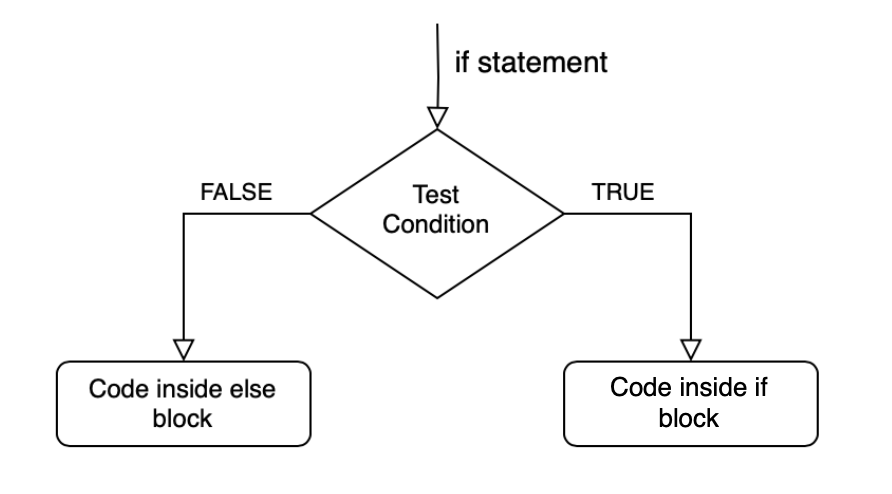
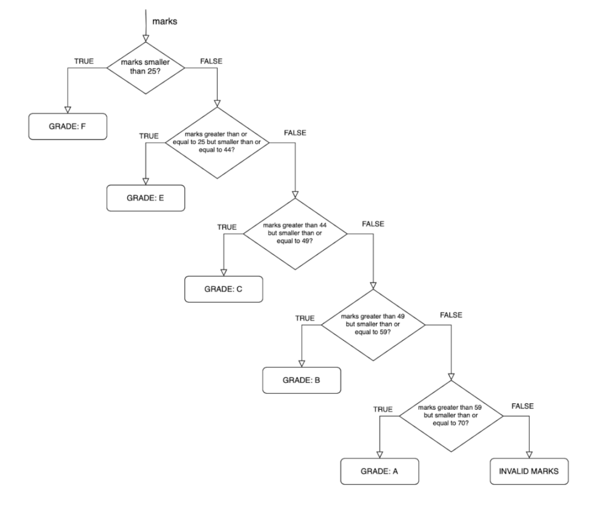

Conditional statements are a fundamental concept in programming that allows you to make decisions based on certain conditions. These statements enable your code to execute different blocks of code depending on whether specific conditions are met or not. In this blog post, we'll delve into the basics of conditional statements, starting with the ubiquitous if-else statement and gradually exploring more complex scenarios.


# The `if-else` Statement



'if statement' is used to execute a block of code only if a certain condition is met. It allows us to conditionally execute code based on whether the specified condition is true.

'else statement', on the other hand, is an optional companion to the if statement. It specifies what code to execute if the condition in the if statement is not met (i.e. if it is false).

Let's break down the flow of control:

If the test condition in the if statement is true, a block of code inside the if block will be executed.
If the test condition is false, the code inside the else block (if present) will be executed.


```python


def age_cal():

    age = 18
    
    if age <= 18:
        print("A")
    else:
        print("B")
        
age_cal()

```


Simplifying Code with "elif"

As your code becomes more complex, you'll often encounter scenarios where you need to check multiple conditions. Instead of writing multiple independent if statements, you can streamline your code using elif statements.

Let's say we want to grade students based on their marks within specific ranges:

```python
def result(total_marks):
    
    
    if total_marks <= 35:
        print("fail")
    elif total_marks >= 35 and total_marks <= 50:
        print("pass")
    elif total_marks >= 50 and total_marks <= 70:
        print("C")
    elif total_marks >= 70 and total_marks <= 80:
        print("B")
    elif total_marks >= 80 and total_marks <= 90:
        print("A")
    else:
        print("A+")
    
total_marks = int(input("enter the number"))
result(total_marks)

```

