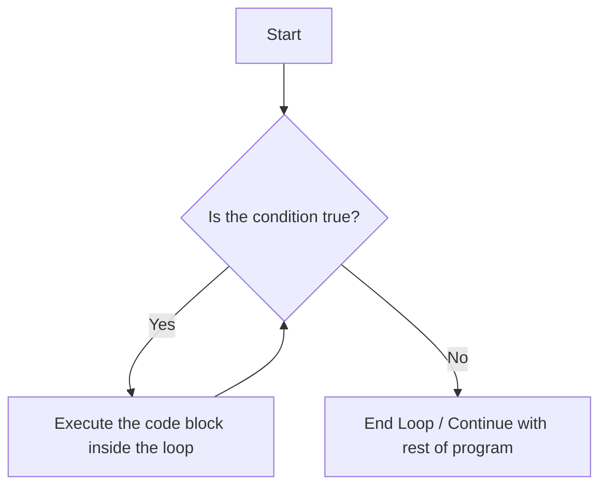

# While Loops in Python: A Deep Dive

## What is a While Loop?

A **`while` loop** is another fundamental control flow statement used for iteration in Python. Unlike a `for` loop that iterates over a sequence of items, a `while` loop executes a block of code **as long as a specified condition remains true.**

Think of it like this:

  * A **`for` loop** is like checking off every item on a shopping list. You know exactly how many items you have to go through.
  * A **`while` loop** is like running on a treadmill *until* you have burned 300 calories. You don't know exactly how long it will take, but you know the condition that will make you stop.

The loop continuously checks the condition before each iteration. If the condition is `True`, the code block is executed. This cycle repeats until the condition becomes `False`.

## Why Do We Need While Loops?

While loops are essential for situations where the number of iterations is **not known in advance**. Their use is determined by a state or condition that can change during the execution of the loop.

Common use cases include:

  * **User Input Validation:** Keep asking a user for input until they provide a valid one.
  * **Game Loops:** Keep the game running as long as the player is alive or hasn't quit.
  * **Processing Data:** Read from a file or network connection until there is no more data to read.
  * **Simulations:** Run a simulation until a specific state is reached (e.g., a value converges).

### The Core Difference: `for` vs. `while`

| Feature | `for` loop | `while` loop |
| :--- | :--- | :--- |
| **Best Use Case** | When you have a finite sequence of items to iterate over (a list, a string, a `range`). **Definite Iteration.** | When you want to loop as long as a condition is true, and the number of iterations is unknown. **Indefinite Iteration.** |
| **Structure** | `for item in iterable:` | `while condition:` |
| **State Management**| Automatic. The loop gets the next item for you. | Manual. You are responsible for managing the state of the condition inside the loop to avoid getting stuck. |

## Diagram: The Flow of a While Loop

A `while` loop's logic is based on a repeated conditional check.



## Python `while` Loop Syntax

The syntax is very straightforward.

```python
while <condition>:
    # Code block to be executed
    # This block MUST be indented
    # IMPORTANT: Something inside this block should eventually
    # make the <condition> False to avoid an infinite loop.
```

  * `while`: The keyword that starts the loop.
  * `<condition>`: A boolean expression (evaluates to `True` or `False`). The loop continues as long as this is `True`.
  * `:`: The colon at the end of the line is mandatory.
  * **Indented Code Block**: The code that runs during each iteration. It's crucial that this block contains logic that will eventually lead to the condition becoming `False`.

## Practical Examples

### 1\. A Counter-Controlled Loop

You can simulate the behavior of `for i in range(5):` with a `while` loop. This clearly illustrates the need for manual state management.

```python
count = 0 # 1. Initialize the counter variable

while count < 5: # 2. Set the condition
    print(f"The count is {count}")
    count = count + 1 # 3. Update the counter (CRITICAL STEP!)

print("Loop finished.")
```

If you forget `count = count + 1`, the value of `count` will always be `0`, the condition `count < 5` will always be true, and you will have an **infinite loop**\!

### 2\. User Input Validation

This is a perfect real-world scenario for a `while` loop. We don't know how many attempts the user will need.

```python
# Keep asking for a name until the user enters something that isn't empty.
name = ""

while name == "":
    name = input("Please enter your name: ")

print(f"Hello, {name}!")
```

### 3\. The Infinite Loop Pattern (`while True`)

Sometimes, an infinite loop is created intentionally. This pattern is common in services that must run continuously (e.g., a web server) or in game loops. The loop is then exited from the inside using a `break` statement when a specific condition is met.

```python
while True:
    command = input("Enter a command (or 'quit' to exit): ")
    if command == "quit":
        break # Exit the loop
    elif command == "hello":
        print("Hello there!")
    else:
        print("Unknown command.")

print("Program terminated.")
```

## Controlling the Loop Flow

Just like `for` loops, `while` loops can be controlled with `break` and `continue`.

### `break`: Exiting the Loop Early

The `break` statement immediately terminates the loop, regardless of whether the loop's main condition is still `True`. We already saw this in the `while True` example.

### `continue`: Skipping the Current Iteration

The `continue` statement skips the rest of the code in the current iteration and jumps directly back to the top to re-evaluate the `while` condition.

```python
# Print odd numbers from 1 to 10
num = 0
while num < 10:
    num += 1
    if num % 2 == 0: # If the number is even...
        continue     # ...skip the print statement and start the next iteration.
    print(num)
```

## The `else` Block in a While Loop

Similar to a `for` loop, a `while` loop can also have an `else` block. It is executed **only if the loop terminates because its condition became `False`**. It does *not* execute if the loop is terminated by a `break` statement.

```python
# A simple countdown
count = 5
while count > 0:
    print(f"T-minus {count}")
    count -= 1
else:
    # This runs because the loop finished normally (count became 0)
    print("Liftoff!")


# A failed search example
attempts = 3
password = "cat"
while attempts > 0:
    guess = input("Enter password: ")
    if guess == password:
        print("Access granted.")
        break
    attempts -= 1
else:
    # This runs only if the loop finishes because attempts reached 0
    print("Access denied. Too many attempts.")
```

## Summary: Key Takeaways

  * **Purpose**: To execute a block of code repeatedly as long as a condition is true.
  * **Best For**: Situations where the number of iterations is unknown beforehand (**indefinite iteration**).
  * **Syntax**: `while condition:` followed by an indented code block.
  * **Critical Responsibility**: You MUST manage the loop's state within the indented block to ensure the condition eventually becomes `False`.
  * **The Danger**: Forgetting to update the state can easily lead to an **infinite loop**, which will freeze your program.
  * **Control**: `break` and `continue` work the same way as in `for` loops to give you fine-grained control over execution.
  * **`else` Clause**: A powerful feature that runs only when the loop terminates naturally.