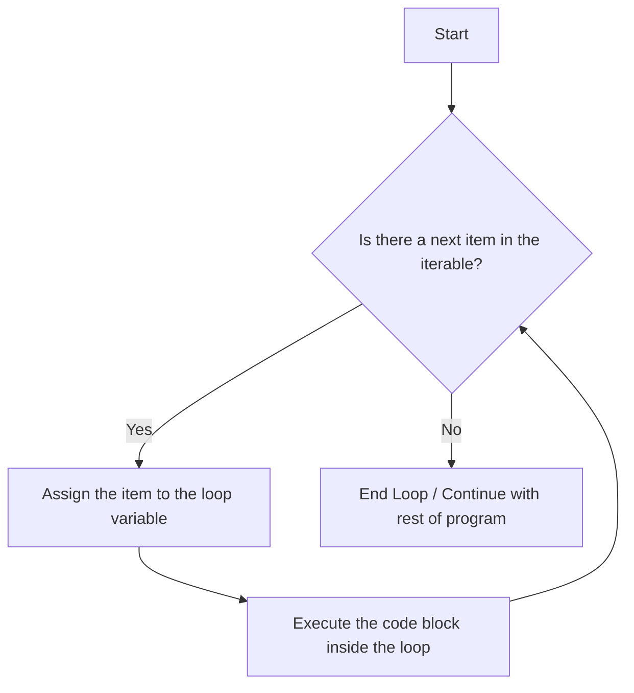

### What is a For Loop and Why is it Used?

A for loop is a control structure in programming that allows you to execute a specific block of code repeatedly. It's especially useful when you want to perform the same task multiple times without duplicating your code. Let's break down the essential components of a for loop:

Initialization: You declare and initialize a variable that serves as a counter. This step only happens once at the beginning.
Condition: You specify a condition that determines when the loop should stop executing.
Increment/Decrement: You define how the counter variable changes after each iteration.


----


📘 For Loop in Python
🔹 What is a For Loop?

A for loop in Python is a control flow statement that is used to iterate (loop) over a sequence such as a list, tuple, string, dictionary, set, or even a range of numbers.

In simple terms:

It helps us repeat a block of code multiple times.

Each iteration picks one item from the sequence until all items are processed.

Python’s for loop is different from languages like C, C++, or Java where you write something like for(int i=0; i<n; i++).
Instead, Python uses the concept of iteration over iterables.

🔹 Why is it Used?

Automation of Repetitive Tasks – Helps avoid writing the same code multiple times.

Traversal of Collections – Easily go through lists, strings, dictionaries, etc.

Cleaner & Readable Code – Reduces chances of errors compared to manually repeating code.

Integration with Functions like range() – Enables controlled looping (like counting numbers).

Supports Complex Operations – Like nested loops, comprehensions, and enumeration.


-----

# For Loops in Python:

## What is a For Loop?

At its core, a **`for` loop** is a fundamental programming construct used for **iteration**. Think of it as an automated way to perform an action on every single item within a collection, one by one, without having to write the same code again and again.

The collection can be anything that is "iterable" in Python, such as:

  * A `list` of items (`['apple', 'banana', 'cherry']`)
  * A `tuple` (`(1, 2, 3)`)
  * A `string` of characters (`"hello"`)
  * A `range` of numbers (`range(5)`)
  * A `dictionary`'s keys or values (`{'name': 'Alice', 'age': 30}`)
  * A `set` (`{10, 20, 30}`)

The `for` loop assigns each item from the collection to a temporary variable and then executes a block of code with that item. Once the block is finished, it moves to the next item and repeats the process until there are no items left.

## Why Do We Need For Loops? The "DRY" Principle

The primary reason for using loops is to adhere to the **DRY (Don't Repeat Yourself)** principle. Imagine you have a list of names and you want to print a greeting for each person.

**Without a loop**, you would have to do this:

```python
names = ["Alice", "Bob", "Charlie", "Diana"]

print(f"Hello, {names[0]}!")
print(f"Hello, {names[1]}!")
print(f"Hello, {names[2]}!")
print(f"Hello, {names[3]}!")
# This is repetitive, error-prone, and doesn't work if the list size changes!
```

This code is:

  * **Repetitive:** You're typing the same `print` statement over and over.
  * **Not Scalable:** What if the list had 1,000 names? You couldn't possibly write 1,000 print statements.
  * **Hard to Maintain:** If you wanted to change the greeting from "Hello" to "Welcome", you'd have to change it in every single line.

**With a `for` loop**, the code becomes elegant, efficient, and scalable:

```python
names = ["Alice", "Bob", "Charlie", "Diana"]

for name in names:
    print(f"Hello, {name}!")
```

This short block of code accomplishes the same task. It automatically handles any number of names in the list, making it robust and easy to read.

## Diagram: The Flow of a For Loop

A `for` loop follows a clear, cyclical path. Here is a flowchart that illustrates its logic:



## Python `for` Loop Syntax

The syntax is clean and readable, almost like plain English.

```python
for <variable> in <iterable>:
    # Code block to be executed for each item
    # This block MUST be indented (usually 4 spaces)
```

  * `for`: The keyword that starts the loop.
  * `<variable>`: A temporary variable that holds the current item from the iterable in each iteration. You can name this anything you want (e.g., `item`, `num`, `char`, `name`).
  * `in`: The keyword that separates the variable from the iterable.
  * `<iterable>`: The collection of items you want to loop through (e.g., a list, string, range).
  * `:`: The colon at the end of the line is mandatory. It signifies the start of the code block.
  * **Indented Code Block**: The code that will be executed for each item. Python uses indentation to define the scope of the loop.

## Practical Examples

### 1\. Using `range()` for a Specific Number of Repetitions

The `range()` function is the most common way to create a sequence of numbers to loop over.

```python
# Example 1: Loop 5 times (from 0 to 4)
print("Looping from 0 to 4:")
for i in range(5):
    print(f"Current number is {i}")

# Example 2: Loop from 2 to 6
print("\nLooping from 2 to 6:")
for num in range(2, 7): # The end number (7) is not included
    print(f"Number: {num}")

# Example 3: Loop from 1 to 10, skipping by 2 (odd numbers)
print("\nPrinting odd numbers up to 10:")
for x in range(1, 11, 2):
    print(f"Odd number: {x}")
```

### 2\. Iterating Over a List

This is the classic use case: performing an action on each element of a list.

```python
fruits = ["apple", "banana", "cherry", "date"]

for fruit in fruits:
    print(f"I would like to eat a {fruit}.")
```

### 3\. Iterating Over a String

A string is just an iterable sequence of characters.

```python
message = "Python"

for char in message:
    print(f"Character: {char}")
```

### 4\. Iterating Over a Dictionary

You can iterate over a dictionary's keys, values, or both.

```python
user_profile = {
    "username": "coder123",
    "level": 15,
    "is_active": True
}

# By default, iterating over a dictionary gives you the keys
print("\nIterating over keys:")
for key in user_profile:
    print(f"Key: {key}, Value: {user_profile[key]}")

# Using .values() to get only the values
print("\nIterating over values:")
for value in user_profile.values():
    print(f"Value: {value}")

# Using .items() to get both key and value (most common method)
print("\nIterating over key-value pairs:")
for key, value in user_profile.items():
    print(f"{key}: {value}")
```

## Controlling the Loop Flow

Sometimes you need to alter the natural flow of a loop. Python provides two keywords for this: `break` and `continue`.

### `break`: Exiting the Loop Early

The `break` statement immediately terminates the loop, even if there are more items left in the iterable.

```python
# Find the first number divisible by 7
numbers = [2, 43, 55, 12, 49, 81, 90]

for num in numbers:
    print(f"Checking {num}...")
    if num % 7 == 0:
        print(f"Found it! {num} is divisible by 7.")
        break # Stop the loop immediately
```

### `continue`: Skipping the Current Iteration

The `continue` statement skips the rest of the code inside the loop for the *current iteration only* and proceeds to the next item.

```python
# Print all numbers except the ones divisible by 3
for i in range(1, 11):
    if i % 3 == 0:
        continue # Skip this iteration and go to the next number
    print(i)
```

## The `else` Block in a For Loop

This is a unique feature of Python. An `else` block can be added to a `for` loop. It will be executed **only if the loop completes its entire sequence without being terminated by a `break` statement.**

This is very useful for search operations.

```python
# Check if a list contains a specific value
my_list = [1, 3, 5, 7, 9]
value_to_find = 6

for item in my_list:
    if item == value_to_find:
        print("Found the value!")
        break
else:
    # This block only runs if the loop finished without a 'break'
    print("Value was not found in the list.")
```

## Nested For Loops

You can place one loop inside another. The inner loop will complete all its iterations for *each single iteration* of the outer loop. This is useful for working with 2D data structures, like grids or matrices.

```python
# Print coordinates for a 3x3 grid
for x in range(3):  # Outer loop (rows)
    for y in range(3): # Inner loop (columns)
        print(f"({x}, {y})")
```

## Summary: Key Takeaways

  * **Purpose**: To automate repetitive tasks by iterating over a sequence of items.
  * **Principle**: Upholds the "Don't Repeat Yourself" (DRY) principle, leading to cleaner, more scalable, and maintainable code.
  * **Syntax**: `for variable in iterable:` followed by an indented code block.
  * **Iterables**: Works with lists, strings, tuples, dictionaries, `range()`, and more.
  * **Control**: Use `break` to exit the loop entirely and `continue` to skip the current iteration.
  * **`else` Clause**: An optional block that runs only if the loop completes naturally (no `break`).
  * **Nesting**: Loops can be nested inside each other to handle more complex, multi-dimensional tasks.