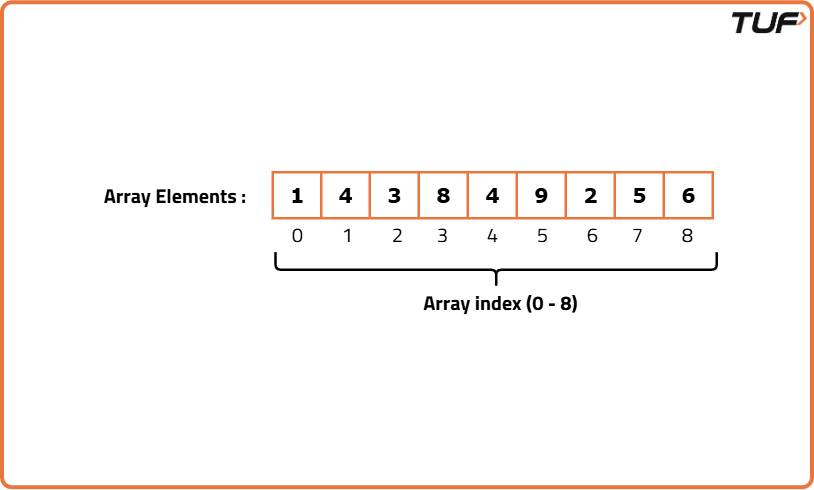
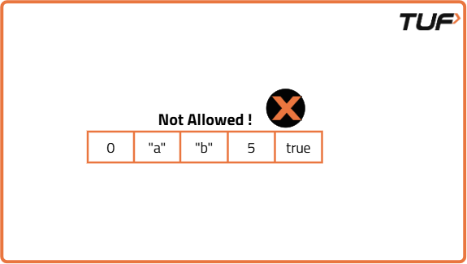
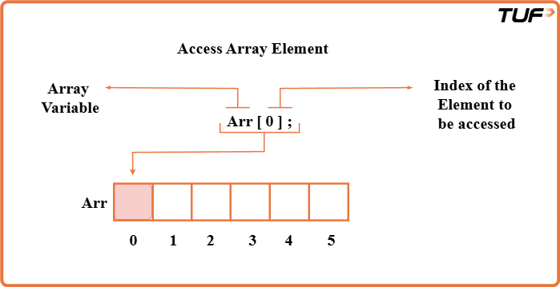

# What is an Array?

An array is a linear data structure in which we store data and perform any operation, we can randomly access data in an array (With the help of its index values). 

In other words, an array is a collection of similar types of elements (Homogeneous elements) that have contiguous memory locations i.e One after another.

Arrays store the related information in adjacent memory blocks.

If you need to access one or more than one element, the process of finding or performing operations on that element becomes very fast because your computer very well knows where the value is located in the memory.


#### Let’s Visualize arrays..!




#### Why are Arrays ‘0’ indexed?


Counting arrays from the index value 0 simplifies the computation for the memory. Though it simplifies the computation. But it adds an extra step of an unnecessary subtraction of 1 i.e (n-1) for each access.

The array of length n can be indexed by the integers from 0 to n-1.

Most programming languages have been designed in this way only, so indexing from 0 is pretty much inherent to the language.


#### Defining an array:


As we already specified, the array contains homogeneous data so the above one is an integer array as it contains integer data.

Arrays can store numbers, strings, boolean values, characters, objects, etc. But once you define the type of values that your array will store, all its elements must be of that same type. You cannot “insert” different types of data in a single array.

Arrays cannot store heterogeneous data, Now what it means.

Let’s understand it through some visuals.




#### Creating an array :

Assign it to a variable (Name of an array).

Define the type of elements that it will store (integer, string, boolean). 

Define its size (the maximum number of elements it will store).

Syntax : Data_type  array_name  [Array_size] ;

E.g: int myarray [8]; 

Int     => Datatype.
myArray => Name of an array.
[8]     => Size of an array.
When you define the size of the array, all of that space in memory is “reserved” 


#### Finding an Element in an array


You have three options to find an element in an array:

If we know where the element is located,We can use the index values to access it.
If you don’t know where it’s located, you can use algorithms to optimize your search, such as Linear, Binary Search, etc.
If you need faster repeated lookups, you can store the array elements in a hash-based data structure (like a hash set or hash map).



----

#### Summary of the Arrays:
Memory is allocated instantly: After the array is created the memory is allocated instantly and the array is empty until you assign the values.
Elements are located in contiguous manner: So the elements can be accessed very efficiently (direct access, O(1) = constant time) using it’s index values.
Arrays are powerful data structures: The type of elements and the size of the array are fixed and defined when you create it. Arrays store elements of the same type (homogeneous).
Inserting elements: Reach to the end of the array and insert the element. The insertion at the end of the array. Insertion takes constant time O(1). We can also insert the elements in the middle or the start of the array but it's a bit of a complex process.
Removing elements: Reach to the index and remove the element. The removal operation takes constant time O(1).


#### What are Strings?


Strings are like a series of characters stored in a specific order. Each character in a string is assigned an index, starting from 0. This means the first character is at index 0, the second character at index 1, and so on.

Let's take an example. Suppose we have a string s containing the word "striver." If we want to access the character 's', we can do so by using s[0], which corresponds to the first character. Similarly, s[1] will give us 't', and s[2] will give us 'r'. This zero-based indexing is a fundamental concept in working with strings.


#### Finding the Length of a String


To determine the length of a string, we can use the size or length function. These functions return the number of characters in the string. For example, if we have s as our string, you can find its length like this:

```python
# Class containing the method to find string length
class Solution:
    # Function to return length of a string
    def findLength(self, s):
        # Return length using built-in function
        return len(s)

# Driver code
if __name__ == "__main__":
    # Create object of Solution class
    obj = Solution()
    # Input string
    s = "Hello World"
    # Call function and print result
    print(obj.findLength(s))

```


#### Accessing Individual Characters

You can access individual characters within a string using square brackets, just like an array. Strings also follow 0-based indexing. For instance:

```python

# Class containing the method to access characters
class Solution:
    # Function to print each character of a string
    def accessCharacters(self, s):
        # Loop through each index
        for i in range(len(s)):
            # Print the character at index i
            print(s[i])

# Driver code
if __name__ == "__main__":
    # Create object of Solution class
    obj = Solution()
    # Input string
    s = "Hello"
    # Call the function
    obj.accessCharacters(s)

```


#### String Comparison
The == known as the equality operator is used for comparing two values to check if they are equal. In programming, it's commonly used to compare variables, such as numbers or strings, to determine if they have the same value. For example, x == y will return true if x is equal to y, and false otherwise.
The != known as the inequality operator is used to check if two values are not equal. It's the opposite of the equality operator. If the values being compared are not equal, != returns true; if they are equal, it returns false. We can check if two strings are equal or not and at the same time we can also check whether particular characters of two strings are equal or not.

```python
# Class containing the compareStrings function
class Solution:
    # Function to compare two strings
    def compareStrings(self, str1, str2):
        # Return true if strings are equal
        return str1 == str2

# Driver code
if __name__ == "__main__":
    # Input first string
    str1 = input()

    # Input second string
    str2 = input()

    # Create Solution object
    obj = Solution()

    # Compare strings and print result
    if obj.compareStrings(str1, str2):
        print("Strings are equal")
    else:
        print("Strings are not equal")


```